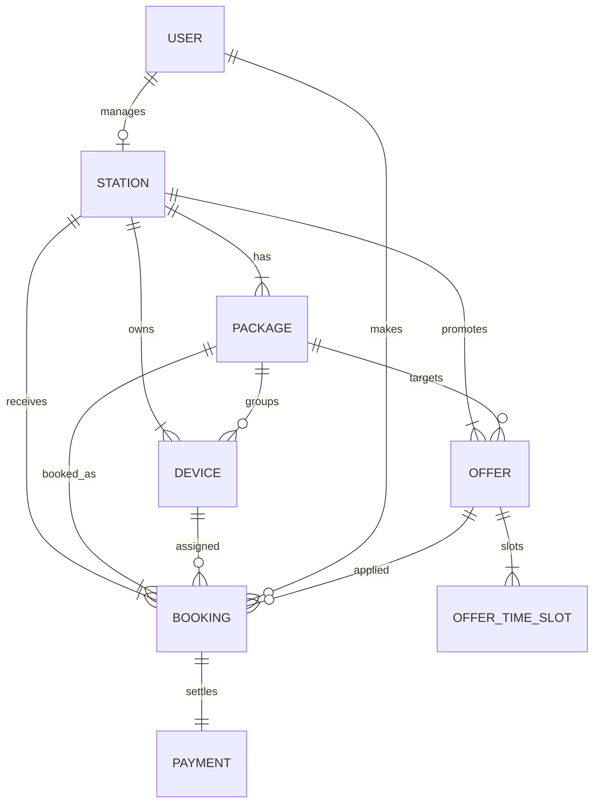
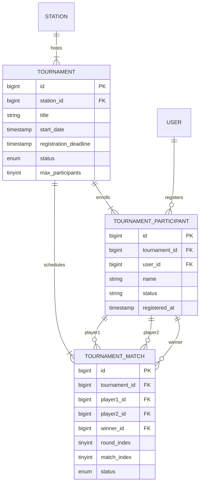
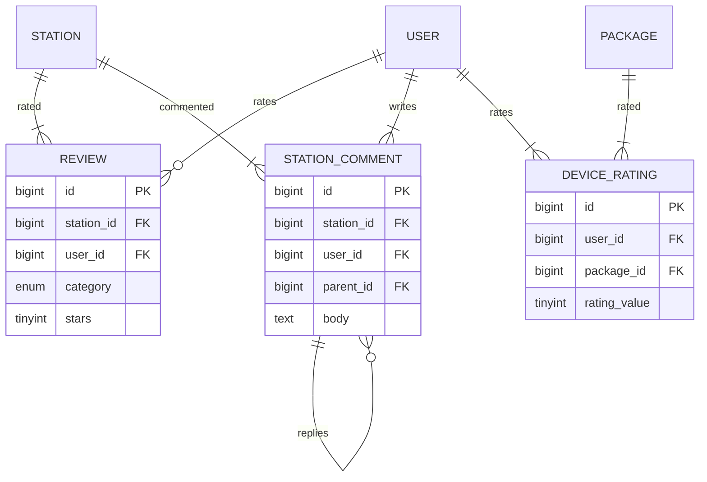
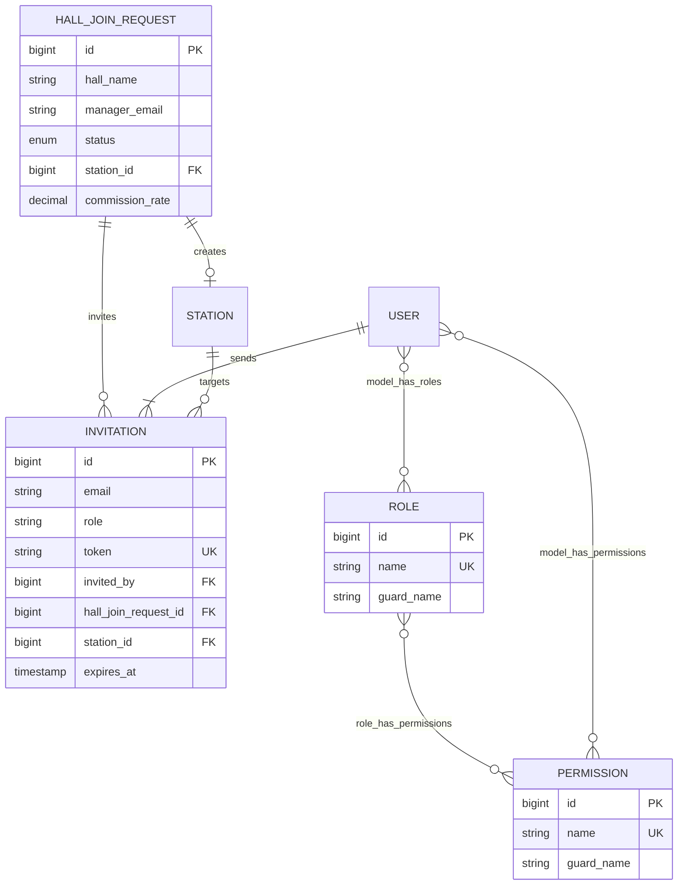

# مخطط ERD — توثيق العلاقات الكامل

## مقدمة

يُقدّم هذا المستند **مخطط الكيانات والعلاقات (Entity Relationship Diagram — ERD)** الكامل لنظام **ZONES**، مستخرجاً من قاعدة البيانات الفعلية.

**الرموز المستخدمة (Chen / Academic Style):**

| الرمز | المعنى |
|-------|--------|
| `PK` | المفتاح الأساسي |
| `FK` | المفتاح الأجنبي |
| `1` | واحد |
| `N` | متعدد |
| `───` | علاقة |
| `◇` | كيان |
| `( )` | خاصية |

---

## 1. مخطط ERD — المستوى العام (General ERD)

```mermaid
erDiagram
    USERS ||--o| STATIONS : "يدير (manager_id)"
    USERS }o--|| STATIONS : "يعمل في (station_id)"
    USERS ||--o{ BOOKINGS : "ينفذ"
    USERS ||--o{ REVIEWS : "يُقيّم"
    USERS ||--o{ STATION_COMMENTS : "يكتب"
    USERS ||--o{ DEVICE_RATINGS : "يُقيّم باقة"
    USERS ||--o{ TOURNAMENT_PARTICIPANTS : "يشارك"
    USERS ||--o{ CUSTOMER_NOTIFICATIONS : "يتلقى"
    USERS ||--o{ STAFF_NOTIFICATIONS : "يتلقى"
    USERS ||--o{ LOYALTY_POINT_TRANSACTIONS : "يكسب/يستبدل"
    USERS ||--o{ PAYMENTS : "يدفع"
    USERS ||--o{ PAYMENT_TRANSACTIONS : "معاملات"
    USERS ||--o{ DEVICE_TOKENS : "أجهزة Push"
    USERS ||--o{ DEVICE_FAULTS : "يُبلّغ"
    USERS ||--o{ HALL_EXPENSES : "يُنشئ"
    USERS ||--o{ STATION_BROADCASTS : "يُبث"
    USERS ||--o{ STATION_BOOKING_STOPS : "يُوقف"
    USERS ||--o{ INVITATIONS : "يُرسل"

    STATIONS ||--o{ PACKAGES : "تحتوي"
    STATIONS ||--o{ DEVICES : "تملك"
    STATIONS ||--o{ BOOKINGS : "تستقبل"
    STATIONS ||--o{ OFFERS : "تُقدّم"
    STATIONS ||--o{ TOURNAMENTS : "تستضيف"
    STATIONS ||--o{ REVIEWS : "تُقيَّم"
    STATIONS ||--o{ STATION_COMMENTS : "تُعلَّق"
    STATIONS ||--o{ HALL_EXPENSES : "مصروفات"
    STATIONS ||--o{ DEVICE_FAULTS : "أعطال"
    STATIONS ||--o{ STATION_BOOKING_STOPS : "إيقاف"
    STATIONS ||--o{ STATION_BROADCASTS : "بث"
    STATIONS }o--o{ SERVICES : "service_station"
    STATIONS ||--o| HALL_JOIN_REQUESTS : "تُنشأ من"

    PACKAGES ||--o{ DEVICES : "تضم"
    PACKAGES ||--o{ BOOKINGS : "تُحجز"
    PACKAGES ||--o{ OFFERS : "عروض"
    PACKAGES ||--o{ DEVICE_RATINGS : "تقييمات"

    DEVICES ||--o{ BOOKINGS : "يُستخدم"
    DEVICES ||--o{ DEVICE_FAULTS : "أعطال"

    BOOKINGS ||--|| PAYMENTS : "دفعة واحدة"
    BOOKINGS ||--o{ PAYMENT_TRANSACTIONS : "بوابة دفع"
    BOOKINGS ||--o{ LOYALTY_POINT_TRANSACTIONS : "نقاط"
    BOOKINGS }o--o| OFFERS : "offer_id"

    OFFERS ||--o{ OFFER_TIME_SLOTS : "فترات"
    OFFERS ||--o{ BOOKINGS : "حجوزات"

    TOURNAMENTS ||--o{ TOURNAMENT_PARTICIPANTS : "مشاركون"
    TOURNAMENTS ||--o{ TOURNAMENT_MATCHES : "مباريات"

    TOURNAMENT_PARTICIPANTS ||--o{ TOURNAMENT_MATCHES : "player1"
    TOURNAMENT_PARTICIPANTS ||--o{ TOURNAMENT_MATCHES : "player2"
    TOURNAMENT_PARTICIPANTS ||--o{ TOURNAMENT_MATCHES : "winner"

    STATION_COMMENTS ||--o{ STATION_COMMENTS : "parent/replies"
    STATION_BROADCASTS ||--o{ STAFF_NOTIFICATIONS : "يُولّد"
    DEVICE_FAULTS ||--o| HALL_EXPENSES : "مصروف صيانة"

    HALL_JOIN_REQUESTS ||--o{ INVITATIONS : "دعوات"

    USERS {
        bigint id PK
        string full_name
        string email UK
        string phone UK
        string google_id UK
        enum account_status
        int loyalty_points_balance
        bigint station_id FK
        bigint manager_of_station
    }

    STATIONS {
        bigint id PK
        bigint manager_id FK
        string name
        string slug UK
        boolean is_active
        boolean is_published
        boolean bookings_enabled
        decimal average_rating
    }

    PACKAGES {
        bigint id PK
        bigint station_id FK
        string name
        enum package_type
        decimal hourly_price
        int minimum_hours
        int maximum_hours
    }

    DEVICES {
        bigint id PK
        bigint station_id FK
        bigint package_id FK
        string device_code
        enum device_type
        enum operational_status
    }

    BOOKINGS {
        bigint id PK
        bigint user_id FK
        bigint station_id FK
        bigint device_id FK
        bigint package_id FK
        bigint offer_id
        string booking_number UK
        enum booking_status
        enum session_status
        decimal total_price
    }

    OFFERS {
        bigint id PK
        bigint station_id FK
        bigint package_id FK
        string title
        decimal original_price
        decimal discounted_price
    }

    TOURNAMENTS {
        bigint id PK
        bigint station_id FK
        string title
        string game_name
        enum status
        int max_participants
    }

    PAYMENTS {
        bigint id PK
        bigint booking_id FK_UK
        bigint user_id FK
        decimal amount
        enum payment_method
    }

    PLATFORM_SETTINGS {
        bigint id PK
        int loyalty_points_per_session
        int loyalty_minimum_points_required
        decimal platform_commission_rate
        string platform_name
        string platform_logo_path
    }
```

---

## 2. مخطط ERD — نواة الأعمال (Core Business)



**Cardinality Legend:**

| الرمز | المعنى |
|-------|--------|
| `\|\|--\|\|` | One and only one |
| `\|\|--o{` | One to zero-or-many |
| `\|\|--\|{` | One to one-or-many |
| `}o--o{` | Many to many |

---

## 3. مخطط ERD — البطولات (Tournament Subsystem)



---

## 4. مخطط ERD — الصيانة والمالية (Maintenance & Finance)

```mermaid
erDiagram
    STATION ||--|{ DEVICE_FAULT : reports
    DEVICE ||--|{ DEVICE_FAULT : has
    USER ||--o{ DEVICE_FAULT : reported_by
    DEVICE_FAULT ||--o| HALL_EXPENSE : generates
    STATION ||--|{ HALL_EXPENSE : tracks
    USER ||--o{ HALL_EXPENSE : created_by
    BOOKING ||--|| PAYMENT : payment
    BOOKING ||--o{ PAYMENT_TRANSACTION : gateway
    USER ||--o{ LOYALTY_POINT_TRANSACTION : loyalty
    BOOKING ||--o{ LOYALTY_POINT_TRANSACTION : earns_from

    DEVICE_FAULT {
        bigint id PK
        bigint station_id FK
        bigint device_id FK
        bigint reported_by FK
        enum status
        decimal maintenance_cost
        boolean archived
    }

    HALL_EXPENSE {
        bigint id PK
        bigint station_id FK
        bigint device_fault_id FK_UK
        bigint created_by FK
        string name
        decimal amount
        boolean is_paid
    }
```

---

## 5. مخطط ERD — التقييم والتفاعل (Reviews & Social)



---

## 6. مخطط ERD — الإشعارات والبث (Notifications)

```mermaid
erDiagram
    STATION ||--|{ STATION_BROADCAST : sends
    USER ||--|{ STATION_BROADCAST : creates
    STATION_BROADCAST ||--o{ STAFF_NOTIFICATION : triggers
    USER ||--|{ STAFF_NOTIFICATION : receives
    STATION ||--o{ STAFF_NOTIFICATION : context
    USER ||--|{ CUSTOMER_NOTIFICATION : receives
    USER ||--|{ DEVICE_TOKEN : push_token

    STATION_BROADCAST {
        bigint id PK
        bigint station_id FK
        bigint created_by FK
        string name
        text body
        string severity
        string status
    }

    STAFF_NOTIFICATION {
        bigint id PK
        bigint user_id FK
        bigint station_id FK
        bigint broadcast_id FK
        string type
        timestamp read_at
    }

    CUSTOMER_NOTIFICATION {
        bigint id PK
        bigint user_id FK
        string type
        string title
        text body
        json payload
    }
```



---

## 7. مخطط ERD — الانضمام والصلاحيات (Onboarding & RBAC)



---

## 8. مخطط ERD — ASCII Academic Style (Full System)

```
╔══════════════════════════════════════════════════════════════════════════════════════╗
║                           ZONES PLATFORM — ERD OVERVIEW                              ║
╚══════════════════════════════════════════════════════════════════════════════════════╝

                              ┌─────────────────────┐
                              │  إعدادات المنصة      │
                              │ platform_settings   │
                              │  (Singleton)        │
                              └─────────────────────┘

┌──────────────┐  1:1 (manager)   ┌──────────────┐  N:M          ┌──────────────┐
│   المستخدم   │◄────────────────►│    الصالة    │◄─────────────►│   الخدمة     │
│    users     │  N:1 (employee)  │   stations   │ service_station│  services    │
└──────┬───────┘                  └──────┬───────┘               └──────────────┘
       │                                 │
       │ 1:N                             │ 1:N
       │                                 ├──────────────────────────────────────┐
       │                                 │                                      │
       ▼                                 ▼                                      ▼
┌──────────────┐                  ┌──────────────┐                        ┌──────────────┐
│    الحجز     │                  │    الباقة    │                        │   البطولة    │
│   bookings   │                  │   packages   │                        │ tournaments  │
└──────┬───────┘                  └──────┬───────┘                        └──────┬───────┘
       │                                 │                                      │
       │ 1:1                             │ 1:N                                  │ 1:N
       ▼                                 ▼                                      ▼
┌──────────────┐                  ┌──────────────┐                        ┌──────────────┐
│   الدفعة     │                  │    الجهاز    │                        │   المشارك    │
│   payments   │                  │   devices    │                        │ participants │
└──────────────┘                  └──────┬───────┘                        └──────┬───────┘
                                         │                                      │
                                         │ 1:N                                  │ 1:N
                                         ▼                                      ▼
                                  ┌──────────────┐                        ┌──────────────┐
                                  │  عطل الجهاز  │                        │   المباراة   │
                                  │device_faults │                        │   matches    │
                                  └──────┬───────┘                        └──────────────┘
                                         │
                                         │ 1:1
                                         ▼
                                  ┌──────────────┐
                                  │ مصروف الصالة │
                                  │hall_expenses │
                                  └──────────────┘

┌──────────────┐  1:N   ┌──────────────┐  1:N   ┌──────────────┐
│    العرض     │───────►│  فترة العرض  │       │  إيقاف الحجز │
│    offers    │        │offer_time_slots│      │booking_stops │
└──────────────┘        └──────────────┘       └──────────────┘

┌──────────────┐  1:N   ┌──────────────┐  1:N   ┌──────────────┐
│  تقييم الصالة│       │ تعليق الصالة │◄─self─│    (ردود)    │
│   reviews    │       │station_comments│      └──────────────┘
└──────────────┘        └──────────────┘

┌──────────────┐        ┌──────────────┐        ┌──────────────┐
│ إشعار العميل │        │ إشعار الموظف │◄───────│  البث الإداري│
│  customer_   │        │   staff_     │  1:N   │  broadcasts  │
│ notifications│        │notifications │        └──────────────┘
└──────────────┘        └──────────────┘

┌──────────────┐  1:1   ┌──────────────┐  1:N   ┌──────────────┐
│ طلب الانضمام │───────►│    الصالة    │       │   الدعوة     │
│hall_join_req │        │   (created)  │       │ invitations  │
└──────────────┘        └──────────────┘       └──────────────┘
```

---

## 9. جدول Cardinality الكامل

| الكيان المصدر | العلاقة | الكيان الهدف | Cardinality | FK Column |
|---------------|---------|--------------|-------------|-----------|
| User | manages | Station | 1 : 0..1 | stations.manager_id |
| User | works_at | Station | N : 0..1 | users.station_id |
| User | makes | Booking | 1 : N | bookings.user_id |
| Station | has | Package | 1 : N | packages.station_id |
| Station | owns | Device | 1 : N | devices.station_id |
| Station | receives | Booking | 1 : N | bookings.station_id |
| Station | offers | Service | N : M | service_station |
| Package | groups | Device | 1 : N | devices.package_id |
| Package | booked | Booking | 1 : N | bookings.package_id |
| Device | used_in | Booking | 1 : N | bookings.device_id |
| Booking | settles | Payment | 1 : 0..1 | payments.booking_id (UQ) |
| Booking | gateways | PaymentTransaction | 1 : N | payment_transactions.booking_id |
| Booking | loyalty | LoyaltyPointTransaction | 1 : N | loyalty_point_transactions.booking_id |
| Offer | slots | OfferTimeSlot | 1 : N | offer_time_slots.offer_id |
| Offer | applied | Booking | 1 : N | bookings.offer_id |
| Tournament | enrolls | TournamentParticipant | 1 : N | tournament_participants.tournament_id |
| Tournament | schedules | TournamentMatch | 1 : N | tournament_matches.tournament_id |
| DeviceFault | expense | HallExpense | 1 : 0..1 | hall_expenses.device_fault_id (UQ) |
| StationBroadcast | notifies | StaffNotification | 1 : N | staff_notifications.broadcast_id |
| StationComment | replies | StationComment | 1 : N | station_comments.parent_id |
| HallJoinRequest | creates | Station | 1 : 0..1 | hall_join_requests.station_id |
| User | roles | Role | N : M | model_has_roles |

---

## 10. القيود الفريدة (Unique Constraints)

| الجدول | القيد | الغرض |
|--------|-------|-------|
| `users` | email, phone, google_id | عدم تكرار الحساب |
| `stations` | slug | رابط فريد للصالة |
| `packages` | slug | رابط فريد للباقة |
| `devices` | (station_id, device_code) | رمز جهاز فريد داخل الصالة |
| `bookings` | booking_number | رقم حجز فريد |
| `payments` | booking_id | دفعة واحدة لكل حجز |
| `reviews` | (user_id, station_id, category) | تقييم واحد لكل فئة |
| `device_ratings` | (user_id, package_id) | تقييم واحد لكل باقة |
| `tournament_participants` | (tournament_id, user_id) | مشاركة واحدة |
| `hall_expenses` | device_fault_id | مصروف واحد لكل عطل |
| `service_station` | (station_id, service_id) | عدم تكرار الربط |
| `invitations` | token | رابط دعوة فريد |
| `device_tokens` | token | توكن Push فريد |
| `payment_transactions` | invoice_no | فاتورة فريدة |

---

## 11. كيانات خارج ERD الرئيسي (Infrastructure)

| الجدول | الغرض | مرتبط بـ |
|--------|-------|----------|
| `personal_access_tokens` | Sanctum API Auth | User (polymorphic) |
| `password_reset_codes` | OTP Reset | email (no FK) |
| `password_reset_tokens` | Laravel Reset | email (no FK) |
| `sessions` | Web Sessions | user_id (indexed, no FK) |
| `cache`, `jobs`, `failed_jobs` | Laravel Queue/Cache | — |

---

## 12. ملخص إحصائي

| المؤشر | القيمة |
|--------|--------|
| إجمالي الجداول | 42 |
| كيانات الأعمال | 28 |
| جداول الربط | 4 |
| كيانات RBAC | 4 |
| كيانات Auth/Infrastructure | 6 |
| علاقات One-to-One | 4 |
| علاقات Many-to-Many | 4 |
| كيانات Soft Delete | 6 |

---

## 13. مراجع الملفات

| الملف | المحتوى |
|-------|---------|
| `entities_analysis.md` | قائمة الكيانات وتصنيفها |
| `entities_attributes.md` | خصائص كل كيان مع مخططات Attributes |
| `relationships_analysis.md` | تحليل العلاقات بالتفصيل |
| `erd_documentation.md` | هذا الملف — مخطط ERD الكامل |

---

*المستند: مخطط ERD — منصة ZONES*  
*المرحلة: System Analysis & Design Documentation (SAD/SRS)*  
*المصدر: Laravel Migrations (54) + Models (27)*  
*التاريخ: يونيو 2026*
